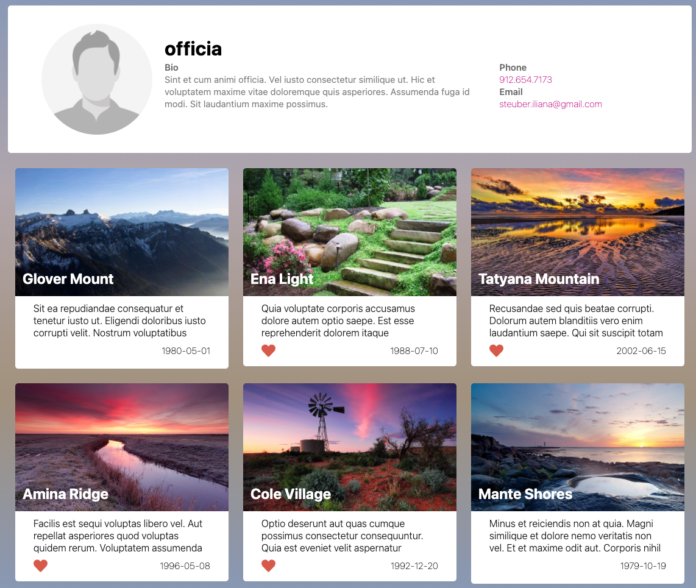
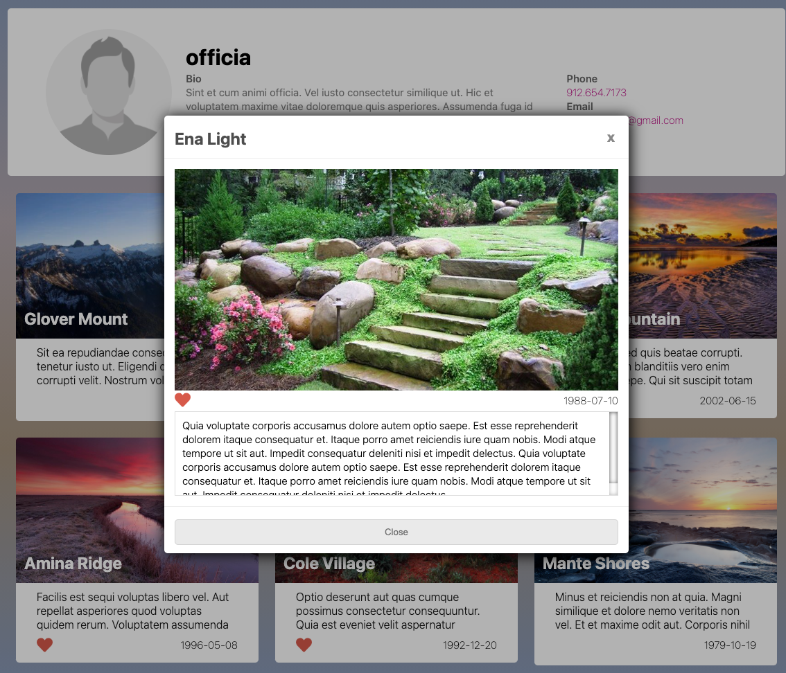

# Laravel + Vue

## Environment

- Laravel 8
- Vue 3
- MySQL 8 on Docker

## Installing 

```shell
$ git clone https://github.com/hyewondev/modzee_test.git

$ cp .env.example .env

$ php artisan key:generate

$ php artisan migrate --seed

$ php artisan serve
```

## Tools Used

- PhpStorm
    - Easy to find files with file name or word in files
    - Import package url of class automatically
    - Manifest unused variables


- DataGrip
    - Intelligent query console
    - Easy to check Explain plan
    - Same shortcut key


## Screens





